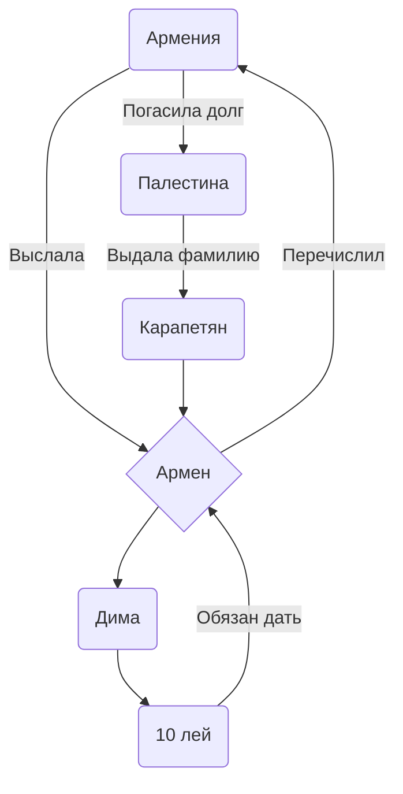

| Команда | Описание |
| --- | --- |
| `Кама Пуля` | Кама Пуля резкий дерзкий как пуля резьба |
| `Лимузин` | У каждого есть свой лимузин с двумя охранниками |
| `Поддержка с воздуха` | Самолёт летит с флагом *"Ребята вы лучшие"* над Ираком |
| `Послать Армению нахуй` | Посла Армении Айран **Жэжкопуйлович** был  выслан из страны за хлебом |
Кебабы подорожали[^1].
Почему кебаб не вкусный?[^2].

[^1]: Причина тому что кебабы подорожали, стало погашение долга Армении в 20109 году.
[^2]: Головач Лена не знает о том что её упомянули здесь.

```json
{
  "Name" :"denbox_2013",
  "FontName" : "Segoe UI",
  "ItemColor" : "111111",
  "TextColor" :"DC143C",
  "SelectedItemColor" :"111111",
  "SelectedTextColor" :"cccccc",
  "BackgroundColor" :"111111",
  "TransparencyColorKey" : "ffffff",
  "ItemHeight" : 20,
  "ItemWidth" : 350,
  "ItemSpacing" : 0
}
```

- [ ] Добавил соль, чтобы был суп вкусный
- [x] _(Необязательно)_ Раскрыть залупу во время дрочки :tada:

<details>
<summary>Раскрыть залупу</summary>
Кебаб не свежий, не ешьте его.
</details>

|Слева|По центру|Справа
|:-   |   :-:   |   -:
|Слева 4 Деда|Арматура|Парапет|
|Кебаб оказался не вкусный|Статус дерьма|Сперма орла|
|Паркет|Стена|Кирпич|
|Милла Йовович|Паркур|Глушитель|

## Почему Армен стал Карапетяном:

Схема показывает как Армения выслала Армена для погашения долга перед Палестиной.

**Пошаговый план:**
1. Армения попросила займы у Палестины
2. Арменя выслала Армена
3. Армен нашёл Диму и попоросил у него 10 лей
4. Дима отдал 10 лей без возврата
5. Армен выслал деньги в Армению
6. Армения погасила долг перед Палестиной
7. Палестина узнала кто на самом деле постарался над погашением долга и в качестве награды даровала фамилию "Карапетян" Армену

https://github.com/boxden/black-source2/blob/49e271dd9c495b5479d7aaedf34010e72f7f9211/Programs/Crowbar%200.74/README.md?plain=1#L3-L8