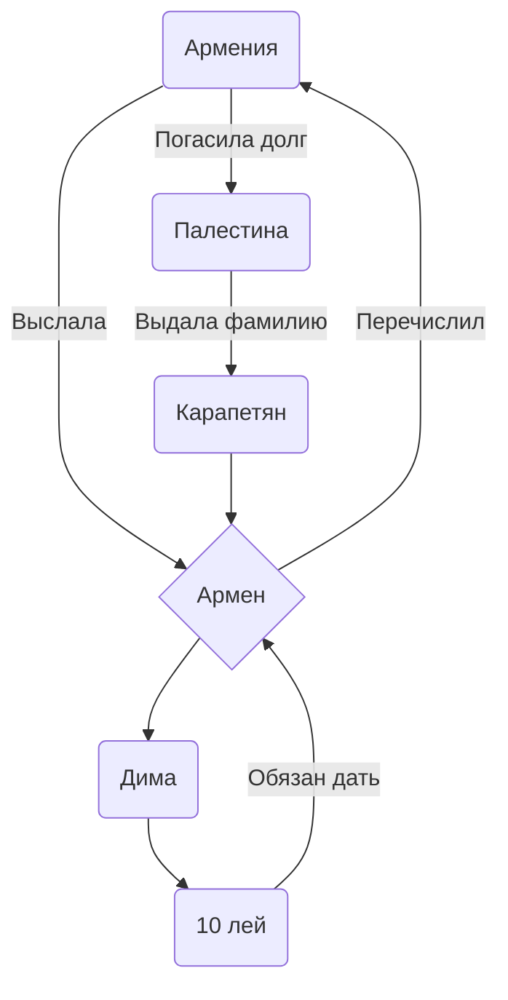

| Команда | Описание |
| --- | --- |
| `Кама Пуля` | Кама Пуля резкий дерзкий как пуля резьба |
| `Лимузин` | У каждого есть свой лимузин с двумя охранниками |
| `Поддержка с воздуха` | Самолёт летит с флагом _"Ребята вы лучшие"_ над Ираком |
| `Послать Армению нахуй` | Посол Армении _Айран Жэжкопуйлович_ был  выслан из страны за хлебом |

Кебабы подорожали[^1].  
Почему кебаб не вкусный?[^2].

[^1]: Причина тому что кебабы подорожали, стало погашение долга Армении в 20109 году.  
[^2]: Головач Лена не знает о том что её упомянули здесь.

- [ ] Добавил соль, чтобы был суп вкусный.  
- [x] _(Необязательно)_ Раскрыть залупу во время дрочки :tada:

Раскрыть залупу

Кебаб не свежий, не ешьте его.

|Слева|По центру|Справа
|:-   |   :-:   |   -:
|Слева 4 Деда|Арматура|Парапет|
|Кебаб оказался не вкусный|Статус дерьма|Сперма орла|
|Паркет|Стена|Кирпич|
|Милла Йовович|Паркур|Глушитель|

## Почему Армен стал Карапетяном:

Схема показывает как Армения выслала Армена для погашения долга перед Палестиной.

**Пошаговый план:**
1. Армения попросила займы у Палестины
2. Армена выслала Армена
3. Армен нашёл Диму и попросил у него 10 лей
4. Дима отдал 10 лей без возврата
5. Армен выслал деньги в Армению
6. Армения погасила долг перед Палестиной
7. Палестина узнала кто на самом деле постарался над погашением долга и в качестве награды даровала фамилию "Карапетян" Армену

https://github.com/boxden/black-source2/blob/49e271dd9c495b5479d7aaedf34010e72f7f9211/Programs/Crowbar%200.74/README.md?plain=1#L3-L8

<!--
<picture>
  <source media="(prefers-color-scheme: dark)" srcset="https://user-images.githubusercontent.com/25423296/163456776-7f95b81a-f1ed-45f7-b7ab-8fa810d529fa.png">
  <source media="(prefers-color-scheme: light)" srcset="https://user-images.githubusercontent.com/25423296/163456779-a8556205-d0a5-45e2-ac17-42d089e3c3f8.png">
  
</picture>
-->

@flykebab  
$kebab remover$  
~~kebabershop~~

1. BLACKTM
2. Gran Turismo 4
3. Tomb Raider: Underworld
4. Medal of Honor: European Assault
5. Battlefield 2: Modern Combat